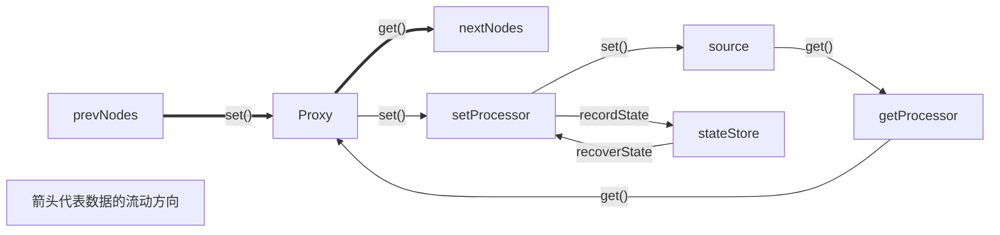

中文 | [English](README.en.md)

# dynamic

又叫 `dynamicJS`、`dnJS`，一个简单的、以数据为中心的前端框架，用于创建现代化的网页应用。

很像 Vue。

# 特性

## 以数据为中心

dynamic 直接关注数据本身，并重视数据的流动。

## 以网页应用为目标

因此 dynamic 内置了 SPA 路由、健全的 AJAX 功能和 manifest.json 生成。ServiceWorker 因不支持动态生成，被放在 [`sw`](//github.com/wheelsmake/sw) 仓库中。

## 无组件

dynamic 中没有组件的概念，你可以把 dynamic 理解为基于字符串的模板引擎，但 dynamic 支持输出 DOM，所以其实一个属性也可以看作是一个组件。

## 强接管 DOM

dynamic 强依赖于 DOM 的不变性。开发者**不能**绕过 dynamic 控制 DOM，否则将带来不可预测的后果。

## 弱化 vDOM

dynamic 不一定会利用 vDOM，并且实际上 dynamic 极少打开 vDOM。在很多时候，使用 vDOM 非常没有意义。

- dynamic 使用 [freeDOM](//github.com/wheelsmake/freeDOM) 作为 vDOM 库，这也是一个自制轮子。

## 尽量少的 DSL

学习新的语法是恼人的，所以 dynamic 在设计时秉承使用基本 HTML 和 JavaScript 语法的原则。

将标记（LJM12914 更喜欢叫它「模板」）和逻辑分离到不同文件是理所当然的分离方式，试问哪家剧院将幕后台下的场面完全敞开给观众？这样做不需要任何视觉上的辅助，也创造了无限细粒度数据重用的可能性。

与 dynamic 的全部交互均可以通过 JavaScript 完成，dynamic 的所有 HTML 插值语法只有一个：双冒号 `::::`。

## 不依赖开发环境

依照 LJM12914 的经验，开发环境是让所有开发者都抓狂的一个东西。dynamic 从开始被设计的第一天起就致力于「消灭」开发环境，它被设计得尽量不依赖任何东西，但又可以通过渐进增强的方式获得更多便捷，例如使用 JSX 和使用 TypeScript。

# 开始使用

## 从页面引入脚本

建议将 dynamic 置于所有脚本之前加载。

```html
<script src="path/to/dynamic.js"></script><!--开发-->
<script src="path/to/dynamic.min.js"></script><!--生产-->
```

## 使用打包工具或 TypeScript 开发

克隆仓库或下载仓库，然后在你的代码中导入 `Dynamic`。

```typescript
import Dynamic from "path/to/dynamic.ts";
```

注意不要导入 `dynamic.export.ts` 而要导入 `dynamic.ts`。


# 数据节点与数据流

数据节点可以被理解为一个物流节点。它自己可以存有数据，并且知道自己的上下游节点，在接收数据和送出数据时能对数据进行一定的处理。

- 导出节点是用来将数据输出到 dynamic 之外的。大部分情况下是输出到 HTML 文档中。

本质上不存在所谓的「节点」，所有数据节点都在一起，


## 写法对比

对比 dynamic 的声明式 HTML 写法和 Vue 的 HTML 模板写法。

这是一个典型的 Vue 应用的 HTML 模板：

```html
<div id="app">
    <div>
        <ul v-for="item in list"></ul>
        <input v-model="inputs" type="text" />
        <button @click="dosth">do something</button>
    </div>
    <span>today is: {{date}}</span>
    <button @click="date++">tomorrow</button>
</div>
```

相信你知道在 JavaScript 中会写什么。上面的模板用 dynamic 实现则是：

```html
<div id="app">
    <div>
        <ul>::lis::</ul>
        <input value="--trans_n--" type="text" />
        <button onclick="dosth()">do something</button>
    </div>
    <span>::today_s::</span>
    <button onclick="::today_s::increase">tomorrow</button>
</div>
```

相应的 JavaScript 脚本：

```javascript
var dy = new Dynamic("#app");
var myArray = ["a","b","c","d"];
window.onload = ()=>{
    dy.exportDN("today_s").setMethod({
        increase(){
            this.value++;
        }
	});
}
```

你可能对各种东西有所疑惑。

1. 这和写直接操作 DOM 的代码有什么区别？

   - 最大的区别是：数据可以在 HTML 中被无限重用。

2. 为什么要在 `window.onload` 后执行这些设置？

   - HTML 中的声明式数据节点要在 dynamic 识别 HTML 文档后才会被创建。

3. 看不懂 dynamic 在做什么

   - dynamic 做了以下事情（可查看 `dynamic.ts > class Dynamic > #detectDN()`）

   1. 识别 HTML 文档中的声明。
   2. 筛选出所有的单纯节点声明，如果目前还没有这个节点，那么创建这个节点。
   3. 然后将这些节点声明转换为对节点的 `export` 方法调用。

4. 按钮的 `onclick` 属性写了什么

   - 这是一个指令节点声明，不是单纯节点声明，作用是调用目标（必须是已存在的）节点 `methods` 中的指定方法。例如上文的 `::today_s::increase` 会被转换为 `today_s.methods.increase()`。又或者传入参数，例如 `::today_s::another("arg")`。

5. 如果直接在 `onclick` 属性上这样写，IDE 会报错

   - dynamic 拒绝 DSL，所以推荐这样写。其实 dynamic 也可以识别所有属性前面加上 `:` 的属性，如 `:id="::ex::"` 会将 `ex` 导出节点应用到 `id` 属性上。
   - 需要注意的是加 `:` 属性的优先级**比没有加 `:` 属性的优先级高**。这是刻意的设计，可以用于一些有初始影响的属性，例如 `id` 属性：`<div id="s1" :id="::ex::"></div>`，在带锚点 URL 访问（`http....#s1`）中可以生效。

6. 

7. 

8. dynamic 中不存在应用内变量，只存在作用域内数据节点，


# 补充说明

## 学习 dynamic

可以前往 [`tests/`](tests) 和 [`sample_projects/`](sample_projects) 目录浏览其中的示例项目。

## 开发环境搭建

```shell
npm i -D webpack webpack-cli typescript ts-loader terser-webpack-plugin
```

其他配置详见 [`package.json`](package.json)、[`webpack.config.js`](webpack.config.js) 和 [`webpack.config-min.js`](webpack.config-min.js)。

## 版权声明

本软件以 MIT License 协议开源。

©2020-2022 LJM12914

## 互动

- 欢迎提出issue，但请保持冷静的态度和对事不对人的基本道德准则。
- 请不要在未与我沟通的情况下发起PR。
- 随便 fork。


dynamic 实例在创建时**不会主动接管任何 DOM 元素**，也**不会生成 vDOM**。

dynamic 只对自己对 DOM 做的事进行优化，并且不会独占 DOM 的控制权。开发者大可以自己绕过 dynamic 控制 DOM。

dynamic 接管由其模板创建的实例、由其 `render()` 方法生成的 DOM 和 `dy.dataFlow.new()` 声明的元素。

- 可以指定 dynamic 接管某个元素。接管后任何数据节点将可用。未接管前 dynamic 不会修改 HTML 中的任何东西。
- 因此仅在需要不同配置时有创建多个 dynamic 实例的需求。

dynamic 的模板引擎基于 `Element` 类型（即：模板内容只能是**一个非文本或注释**的 DOM 节点）。但是 dynamic 的 DOM 监控引擎基于 `Node[]` 类型。

dynamic 最大的特性就是：在非常重要的新特性或非常大的性能提升前基本不考虑兼容性。dynamic 目前使用的较新 API 有：

- `class` 和私有属性（被 TypeScript 编译消除）
- `Proxy`

#  开始使用

实例化。

```typescript
const dy = new Dynamic(options? :object);
```

|   参数    |                      描述                       |
| :-------: | :---------------------------------------------: |
| `options` | 用于更改某些行为，详情请见[实例配置](#实例配置) |

对一般的页面来说，创建一个实例即可。

# 复用 HTML

## 关于 `tuID`

`tuID` 是 dynamic 内部识别模板的唯一方式。它是一个长度大于等于 3 个字符的字符串，只能包含小写字母、数字或连字符 `-`，且在不是开头和结尾的字符中有至少一个连字符。

当 dynamic 自动生成 `tuID` 时，其长度总是为 29 字符，并且第 12 个字符总为连字符 `-`，因为 dynamic 的开发者是 LJM**129**14。总共可能生成 4.23e+37 个 `tuID`，基本不用担心碰撞。

此规范的目的是能将每一个 `tuID` 都作为一个有效的自定义元素（[Web Component](https://developer.mozilla.org/zh-CN/docs/Web/Web_Components)）使用。

以下给出正确和错误示例：

```typescript
"p-u" //正确
"qwer-tyuiop" //正确
"multiple-hyphen-element" //正确
"repeated---hyphens" //正确
"ewr-3a" //正确

"q" //错误，字符数太少
"-adadad" //错误，在开头出现连字符
"asdfg" //错误，无连字符

"asdfg-" //错误，在结尾出现连字符（但却是有效的自定义元素，dynamic为了保持标签美观而将其视为错误。）
```

## 注册模板

### 从 `<template>` 元素

dynamic 会默认转换文档中所有的 `<template>` 元素为 dynamic 模板。

如果一个 `<template>` 具有 `dynamic` attribute，那么它将会在变为模板后被 dynamic **从文档中移除**。

如果一个 `<template>` 具有 `nodynamic` attribute，那么它将会被 dynamic 忽略。

如果一个 `<template>` 不具有以上两个 attribute，那么它将会被 dynamic 声明式注册。

- dynamic 会监听DOM变化。运行时释放 `<template>` 元素也会被 dynamic 处理。
- 使用 `tuid` attribute 可自定义 `<template>` 元素被注册为模板时的 `tuID`。无效的 `tuid` attribute 会使 dynamic 自己生成一个。

- 从 `<template>` 元素注册存在弊端：dynamic 缺少对 shadow DOM 的支持，所以所有 `<template>` 元素转换为模板后都会**丢失其 shadow DOM 状态**，其内容被一个顶级 `<div>` 元素包裹。

### 从命令

```typescript
dy.template.register({
    element :Element,
    tuID? :string,
    remove? :boolean
}) :string;
```

|   参数    |              描述              |
| :-------: | :----------------------------: |
| `element` |       要注册为模板的元素       |
|  `tuID`   |      自定义元素的 `tuID`       |
| `remove`  | 是否在注册后从文档中删除该元素 |

使用 `tuID` 参数时，请注意遵循 [`tuID` 格式](#关于 tuID)，否则报错。

该方法返回模板的 ID `tuID`，用于使用该模板。

- 当已存在相同 `tuID` 时，dynamic 不会默默地用新的 `tuID` 代替，而是会直接报错。如果设置了[碰撞检测](#enableAntiClash)，那么 dynamic 会调用 `clashHandler` 方法。

### 特别提示

模板注册时使用了 `Node.cloneNode()` 方法对传入的元素进行拷贝，这会导致该元素及其后代元素的**通过 JavaScript 绑定的事件被完全移除**。在不远的未来可以考虑对此缺陷进行补偿（TODO）。

## 使用模板

在文档的指定位置插入模板：

```typescript
dy.template.render({
    tuID :string,
    element :Element,
    slots? :Record<string, any>,
    removeOuterElement? :boolean,
    insertAfter? :boolean,
    append? :boolean,
    disableDF? :boolean
}) :Nodes[];
```

|         参数         |                             描述                             |
| :------------------: | :----------------------------------------------------------: |
|        `tuID`        |                          模板的 ID                           |
|      `element`       |                         插入目标元素                         |
|       `slots`        |               模板变量，详见[下文](#模板变量)                |
| `removeOuterElement` |      是否将模板最外层的元素（通常是打包用元素）自动删除      |
|    `insertAfter`     | `true`：在目标元素后插入模板；`false`：在目标元素前插入模板  |
|       `append`       | `true`：在目标元素中的最后插入模板；`false`：在目标元素中的最前插入模板；优先级高于`insertAfter` |
|     `disableDF`      | 渲染好的实例会默认被 dynamic 接管，设置该参数为 `true` 以禁用这个行为 |

该方法以节点数组形式返回文档中被插入的模板实例。

或者也可以直接在 HTML 中释放标签名为 `tuID` 的元素，dynamic 会自动将其替换为模板内容。

- dynamic 不会扫描已有的 DOM，释放必须在注册相应模板**后**发生。（TODO：要扫描）

```typescript
dy.e("#myelement").append(document.createElement("my-tuid"));
```

```html
<my-tuid>
    <div>I will be deleted.</div>
    <slot name="a">I'm the value of 'a'</slot>
</my-tuid>
```

- 在这个元素中存在的所有 DOM 都将被删除，全部替换为模板内容。

- 释放带模板变量的模板：参见[模板变量](#模板变量)。

## 插槽

在 dynamic 中，可以通过 `slot` 元素在模板中插入变量，通过 dynamic ，其在功能与原生几乎相同的同时增强了兼容。

- 模板变量不是数据节点，与[数据流管理](#数据流管理)中的数据节点不是同一个概念。模板变量被设计为一次性的替换。
- dynamic 处理模板变量的时机是每一次渲染时，使用 `getContent()` 方法仍可以取到原封不动的传入 DOM。

使用渲染方法：

```html
<template tuid="my-template">
    <div>
        <slot name="slot1" html></slot>
        <p>............<slot name="slot2">default content</slot>.....</p>
    </div>
</template>
```

```typescript
dy.template.render({
    tuID: "my-template",
    element: dy.e("#targetElement"),
    slots: {
        "slot1": "<span style='color: red;'>slot1's red HTML content</span>",
        "slot2": "slot2's content"
    },
    removeOuterElement: true,
    insertAfter: false,
    append: false,
    disableDF: false
});
```

- 为避免 XSS，需要在 `<slot>` 中特别声明 `html` attribute 才能在模板变量中插入 HTML。插入的 HTML 中的 `<slot>` 无论如何都不会被转换，为了使 dynamic 的行为可预知，请**不要嵌套** `slot` **元素**。（TODO：处理嵌套slot）
- 没有 `name` attribute 或没有提供与其 `name` attribute 一致的变量内容的 `<slot>` 会被直接转换为文本节点。所以，`<slot>` 若含有内部内容（如上文的 `#slot2`），则其将成为缺省值，在没有提供该 `<slot>` 的变量值而使用模板时将会使用该值。
- 拥有相同 `name` attribute 的 `<slot>` 在提供了相应 `name` 的值时将共享这一值。
- 当传入的内容为 `undefined`（`typeof undefined`，`void 0`）时，dynamic 会选择性忽略该 `<slot>`，有利于便捷地书写渲染方法。

释放带模板变量的模板：

```html
<!--tuID = my-tuid-->
<my-tuid>
    <slot name="ass">ass</slot>
    <slot name="saa">saa</slot>
</my-tuid>
```

- 不需要注意书写顺序。dynamic 会自动将模板中的变量与元素中赋值的模板变量进行比对并插入。
- 模板中无此 `name` 或不具名的 `<slot>` 将被直接丢弃。
- 当传入的内容为 `undefined`时，dynamic 不会忽略该 `<slot>`，因为它的类型是 `string`。不可能在 HTML 中写出真正的 `undefined` 类型。

## 其他操作

### 更新模板

```typescript
dy.template.update({
    tuID :string,
    element :Element
}) :Element | null;
```

|   参数    |           描述           |
| :-------: | :----------------------: |
|  `tuID`   |        模板的 ID         |
| `element` | 要替换原来模板元素的元素 |

该方法返回旧的模板内容。当不存在相应模板时返回 `null`。

### 删除模板

```typescript
dy.template.delete(tuID :string) :Element | null;
```

|  参数  |   描述    |
| :----: | :-------: |
| `tuID` | 模板的 ID |

该方法返回模板内容。当不存在相应模板时返回 `null`。

### 获取模板内容

```typescript
dy.template.getContent(tuID :string) :Element | null;
```

|  参数  |   描述    |
| :----: | :-------: |
| `tuID` | 模板的 ID |

该方法返回模板内容。当不存在相应模板时返回 `null`。

### 检查一个 `tuID` 是否存在

```typescript
dy.template.existsTUID(tuID :string) :boolean;
```

|  参数  |   描述    |
| :----: | :-------: |
| `tuID` | 模板的 ID |

返回是否在已注册模板中找到了 ID 与传入 `tuID` 相同的模板。

- 该方法完全可以用 [`dy.template.getContent()`](#获取模板内容) 代替，我也觉得没啥用。

### 检查一个模板内容是否存在

```typescript
dy.template.existsElement(element :Element) :string | null;
```

|   参数    |      描述      |
| :-------: | :------------: |
| `element` | 模板的内容元素 |

如果在已注册模板中找到了内容与传入 `element` **等价**（`Node.isEqualNode()`）的模板，则返回该已注册模板的 `tuID`；否则返回 `null`。

- 模板内容不可能与任何节点相同，因为注册时使用了 `cloneNode()` 获得原内容的拷贝。

### 获取所有模板信息

```typescript
dy.template.getTemplates() :object[];
```

该方法返回如下结构的对象：

```json
[
    {
        id: "tuid",
        content: [Element]
    },
    ...
]
```

|   属性    |    描述    |
| :-------: | :--------: |
|   `id`    | 模板的 ID  |
| `content` | 模板的内容 |

### 获取一个模板的实例信息（TODO）

获取指定模板的实例：

```typescript
dy.template.getInstance(tuID :string) :object[];
```

|  参数  |   描述    |
| :----: | :-------: |
| `tuID` | 模板的 ID |

该方法返回如下结构的对象：

```json
[
    {
        reference :Element,
        slots:[
            [slot_name :string] :string,
            ...
        ]
    },
    ...
]
```

|    属性     |                        描述                        |
| :---------: | :------------------------------------------------: |
| `reference` |                     模板的实例                     |
|   `slots`   | 该实例使用的变量，如未赋值则为缺省值或 `undefined` |
| `slot_name` |                       变量名                       |

- 该方法**不能获取**渲染时 `removeOuterElement` 参数为 `true` 的元素，因为其最外层元素已被删除。这时需要使用数据流中的获取作用域然后手动筛选的方案。

# 数据流管理（TODO）

## 作用域

数据流管理仅在作用域内有效，这样做主要是为了减少不必要的性能开销。

### 新建作用域

声明 dynamic 应接管某元素及其后代：

```typescript
dy.dataFlow.new(element :Element) :void;
```

|   参数    |     描述     |
| :-------: | :----------: |
| `element` | 应查看的元素 |

声明后，dynamic 才会识别并转换其中的所有有效数据节点。

### 获取所有作用域信息

```typescript
dy.dataFlow.getScopes() :Element[];
```

### 移除作用域

- dynamic 会自动删除嵌套作用域中较小的那个，不需要手动操作；同时如果需要将作用域变小，请先移除祖先作用域再添加后代作用域，否则后代作用域在添加时会被忽略。

```
dy.dataFlow.deleteScope(identity :Element | number) :Element | null;
```

|    参数    |                             描述                             |
| :--------: | :----------------------------------------------------------: |
| `identity` | 要删除的元素或要删除的元素在 `dy.dataFlow.getScopes() ` 中的索引 |

该方法返回作用域元素，当不存在相应作用域时返回 `null`。

## 数据节点（TODO）

dynamic 使用数据节点 + 网结构来管理数据流。数据节点使用 `Proxy` 实现。

数据节点可以包含任何 JavaScript 对象。在目前的 dynamic 中，数据节点内容是**动态类型**的。以后可能会更改以提供类型检测功能。

数据节点分为两种：一种是 `处理节点`，又称普通节点，存在于 JavaScript 中

每个数据节点都可以有 `上游节点`（`prevNodes[]`），但是只有 JavaScript 中的数据节点可以有 `下游节点`（`nextNodes[]`），因为 HTML 中的数据节点不能被侦测。因此我们将 HTML 中的数据节点也称为 `导出节点`。

可以将数据节点想象为一个容器。



数据节点由对象来源 `source`、代理 `Proxy`、处理方法 `processor`、节点信息和状态存储区 `stateStore` 组成。

## 创建数据节点（TODO）

本来的方法叫做 `dy.dataFlow.createDataNode()`，但是考虑到这个方法非常常用，dynamic 提供了一个捷径：`dy.n()`。

```typescript
dy.n({
    name :string,
    scope? :string,
    source :any,
    setProcessor? :Function,
    getProcessor? :Function,
    prevTags? : string[],
    nextTags? :string[]
});
```

|      参数      |                             描述                             |
| :------------: | :----------------------------------------------------------: |
|     `name`     |                           调用名称                           |
|    `scope`     |               分组，详见[下文](#数据节点分组)                |
|    `source`    | 真正的数据所在的地方，可以直接是数据、是变量或者是某个对象的属性 |
| `setProcessor` |                  设置数据时对数据的处理方法                  |
| `getProcessor` |                  读取数据时对数据的处理方法                  |
|   `prevTags`   |               标签数组，用于快速连接到上游节点               |
|   `nextTags`   |               标签数组，用于快速连接到下游节点               |

- 注意这里的 `get` `set` 是相对于**数据本身**来说的。可以参见上面的流程图。

`name` 调用名称必须只能含有数字、小写字母或下划线，并且数字不能出现在第一位。这样的规则是为了兼容 JavaScript 变量名与 HTML attribute。

`source` 可以是任何值，如果传入的值是一个引用，那么需要注意的是**直接修改**原本的数据时 dynamic 无法检测到变动，从而也无法响应式流转数据。建议直接新建一个。但是如果真的要修改原本的数据也有告诉 dynamic 的方法，见[下文](#被动检测)。

### 数据节点分组（TODO）

有时需要用到两个同名数据节点。这时可以将它们分入不同的 `组` 内，组本身也是一个数据节点，用数据节点获取数据节点的数据了属于是。按照这个思路完全可以自己封装一个 API，但 dynamic 已经封装好了。调用创建节点的方法时，如果指定了 `scope` 参数，则 dynamic 将自动创建一个分组。

## 被动检测（TODO）

由于 JavaScript 的诸多限制，根本不可能做到完全的将数据保存在外部并全程主动检测数据。dynamic 选择了前者而牺牲了全程主动检测数据变动的能力，但是没关系，还有被动检测呢。告诉 dynamic 应查看数据的变动：

```typescript
dy.dataFlow.updateData(scope.name? :any) :object;
```

|     参数     |                 描述                 |
| :----------: | :----------------------------------: |
| `scope.name` | （带分组的）调用名称，不写则全部遍历 |

## 创建导出数据节点（TODO）

一般来说导出节点都是 dynamic 自己根据 HTML 中的声明式标记生成的，但是如果就是不想在 HTML 中写这些奇怪的东西，那么手动创建一个导出数据节点能帮到你。

```typescript
dy.dataFlow.createExportDataNode({
    target :Element,
    prevTags? :string[],
    exportProcessor :(target) => void
}) :string;
```

| 参数 |     描述      |
| :--: | :-----------: |
| `id` | 导出节点的 ID |

## 声明式 HTML（TODO）

看框架的文档时，这个部分是我最不喜欢的部分。虽然能简化操作，但需要学习不同的奇怪语法，并且还有更加奇怪的互相限制。dynamic 中简化语法势在必行。它的声明式语法确实很简单，只有一种语法：`::dataNode::`。

在之前已经出现过一些声明式 HTML attribute：`<template>` 的 `tuID` 和 `dynamic`。这些**不属于**这里所说声明式 HTML 的范畴。声明式 HTML 是基于 `导出数据节点`（名词）的。

```html
<div id="::data1::"></div>
```

其实就是给 div 的 `id` 属性绑定了一个导出数据节点。然后用 JavaScript 连接节点，即可使这个 div 的 `id` 属性被动态更改。

叠满 buff：

```html
<div ::scope4.data2::="::scope3.data3::">::scope2.data4::</div>
```

- 不考虑动态标签名，因为可能导致很严重的 XSS，并要进行 DOM 的销毁和重建。

最佳实践推荐：HTML 文档只负责接收导出的数据，所有工作都在 JavaScript（准确地说是在数据节点的 `getProcessor` 和 `setProcessor`）中完成。当然这里确实可以插入一些 JavaScript 表达式，但强烈不推荐这样做。

不要学习下文这个例子！

```html
<div ::scope4.data2 + "1"::="::scope3.data3.reverse()::">
    ::scope2.data4 ? scope2.data4 : "empty" ::
</div>
```

如果对这种有点奇怪（但是确实没有违反 HTML 标准！）的语法感到不舒适或者有其他需求（如纯 HTML 可用性保证），也可以使用手动创建导出节点的方案，见[上文](#创建导出数据节点)。

# 工具方法

如果你选择相信手动的力量或愿意接受 dynamic 提供的优化，那么可以尝试使用这些工具方法。

## 直接渲染

向文档中渲染任意 HTML。小心 XSS。

```typescript
dy.render({
    HTML :string | Element | HTMLCollection | Element[] | Node | NodeList | Node[],
    element :Element,
    insertAfter? :boolean,
    append? :boolean,
    disableDF? :boolean
}) :Node[];
```

|     参数      |                             描述                             |
| :-----------: | :----------------------------------------------------------: |
|    `HTML`     | 要渲染的 HTML，可以是上面代码中提到的所有类型，方法会自动将其转换 |
|   `element`   |                           目标元素                           |
| `insertAfter` | `true`：在目标元素后插入 HTML；`false`：在目标元素前插入 HTML |
|   `append`    | `true`：在目标元素中的最后插入 HTML；`false`：在目标元素中的最前插入 HTML；优先级高于 `insertAfter` |

`insertAfter` 和 `append` 的共同缺省值是：在目标元素后插入 HTML。

该方法返回一个由 Node 组成的 Array，包括传入的 HTML 字符串中的所有顶级元素。

## 重复填充

从单个对象获取重复填充该对象的数组。

```typescript
dy.repeat({
    item :any,
    count :number
}) :any[];
```

|  参数   |      描述       |
| :-----: | :-------------: |
| `item`  |    填充对象     |
| `count` | 次数，必须大于0 |

该方法返回一个 Array。

## 获取元素

> 从 [`luery`](https://github.com/ljm12914/luery) 处直接复制粘贴的代码。

```typescript
dy.e(s :string, scope? :Element | Document) :Node[] | Node;
```

|  参数   |                     描述                      |
| :-----: | :-------------------------------------------: |
|   `s`   |                  css 选择器                   |
| `scope` | `querySelector` 的作用域，不填默认 `document` |

仅当传入选择器的最终选择器为 ID 选择器（即 `#` ）且获取到元素时返回 `Node` 类型单个元素，否则返回  `Node[]` 类型。

- 这是 dynamic 里唯一一个没有单对象参数化的多参数方法。

## 字符串转 HTML

从字符串获取等价 HTML DOM：

```typescript
dy.toHTML(HTML :string) :Node[];
```

|  参数  |       描述       |
| :----: | :--------------: |
| `HTML` | 有效 HTML 字符串 |

## DOM 脱壳

将某些同父元素的元素从它们的父元素里脱出，放入祖父元素内。使用模板时非常实用的方法。

```typescript
dy.hatch({
    element :Element,
    remove? :boolean
}) :Node[]
```

|   参数    |            描述            |
| :-------: | :------------------------: |
| `element` |           父元素           |
| `remove`  | 是否在操作完成后删除父元素 |

该方法返回被脱壳的子元素数组。

## 重复 DOM 操作优化（TODO）

- 浏览器很讨厌这种代码：

```typescript
for(let i = 0; i < 1000; i++){
    dy.template.render({
        tuID: "my-tuid",
    	element: dy.e("#myelement"),
    	append: true
    })
}
```

任何对已渲染 DOM 的操作都是比较耗时的，特别是那些会触发重排 / 重绘的操作。对此 dynamic 提供了一个优化方法，可以将很多 DOM 操作：

```typescript
dy.compose({

}) :Node[];
```

| 参数 | 描述 |
| :--: | :--: |
|  ``  |      |
|  ``  |      |

# 实例配置（TODO）

在创建实例时传入配置。

```typescript
const dy = new Dynamic(options);
```

下面是对 `options` 对象的有效属性的描述，注意所有属性都是**可选的**。无效的属性将被 dynamic 忽略。

|                   有效属性                    |      类型       |             描述             |
| :-------------------------------------------: | :-------------: | :--------------------------: |
|           [`rootScope`](#rootScope)           |    `Element`    | 创建实例时顺便指定一个作用域 |
| [`renderSecurityLevel`](#renderSecurityLevel) | `0 | 1 | 2 | 3` |      渲染 HTML 安全级别      |
|    [`bannedTagName`](#renderSecurityLevel)    |   `string[]`    |     禁止渲染的 HTML 标签     |
|      [`tInstanceLimit`](#tInstanceLimit)      |    `number`     |    限制模板实例的保存数量    |

## rootScope

用于在创建实例时顺便指定一个作用域。更多信息请参见[新建作用域](#新建作用域)。

## renderSecurityLevel

该参数默认值为 2 。

通过配置该参数来限制 dynamic 渲染危险的 HTML DOM，以免因疏忽大意而造成许多问题。

0. 可渲染任何 DOM（不推荐！）。
1. 禁止渲染 `<script>` 元素。
2. 在 1 级基础上禁止渲染 `<html>` `<body>` `<head>` 元素。
3. 在 2 级基础上禁止渲染一切带有事件绑定 attribute 的元素。

若要自定义禁止渲染的元素**标签**，可以配置 `bannedTagName`，示例：

```json
{"bannedTagName": [
    "style",
    "link"
]}
```

## tInstanceLimit

dynamic 在渲染每一个模板后都会记录有关数据，但是这些数据少有用处，在需要渲染海量模板的页面上还会导致性能下降。这可以通过修改 `tInstanceLimit` 解决，它限制了能同时存在的模板实例的最大值。一旦突破这个值，dynamic 就会删除当前最早的实例记录。设为 0 以完全禁用保存模板实例数据功能。设为 -1（默认值）以取消对模板实例记录数量的限制。

# 补充说明

### 

## 开发背景与设计意图

dynamic 和市面上的 JavaScript 框架（下简：框架）大致属于同一类产品。目前的三大框架 `React`、`Vue` 和 `Angular`，我多多少少都用过一点，通过自身使用的感受，我开发了 dynamic。顺便说一句，React 是我觉得的在这三个框架中最繁琐的，所以下面的缺点大多数都体现在 React 中。

在我看来，这些框架存在以下优点：

1. 极大提升了 UI 开发效率，**特别是针对某一类 UI 的批量开发**。
2. 声明式编程，更贴近自然思维。
3. 便于管理数据的流动与展示。
4. 可以满足服务端渲染需求。
5. 使代码重用率提升，减小代码库。

但也存在以下缺点：

1. 各个框架均存在各自不同的语法和编程形式，这让学习一个框架因需要适应新语法而变得困难，相同问题也见于切换框架。
2. 相对原生 API 来说，框架的性能普遍不高。
3. 框架的开发环境搭建费力，特别是某些需要通过预编译器编译代码的框架。
4. 声明式编程让开发者对框架在幕后做了什么几乎一无所知，导致需要不停地查阅文档。这同时也导致事件处理的混乱和 hook 的诞生，进而导致需要进一步地大量研读文档。

dynamic 在付出抛弃一些优点的代价后，做到了以下特性：

1. 仅在 HTML 中允许部分声明式编程，其余绝大部分使用命令式编程。
   - 这让我们可以在事件处理到需要调用 dynamic 的时候正确地使用 dynamic，而不是对框架用 hook 函数。
   - 这损失了什么？喜好声明式编程的开发者的效率。但是开发者的思维不应该就是命令式的吗？为了提高效率或让开发者读起来舒服而把大量权力交给框架内部，然后不停地翻查文档找它会自己干些什么，我不觉得这是一件聪明事。
2. 抛弃自定义语法，尽可能贴近原生语法与原生 API。
   - 这让学过 JavaScript 和现代浏览器原生 API 的开发者可以快速上手 dynamic。
   - 这损失了一些编程效率，但在可接受的范围内，因为 dynamic 普遍采用命令式编程。
3. 使用节点连接的方式控制数据流。
   - 这存在一定的性能问题。
   - 这几乎完美解决了双向数据流和数据隔离问题，并且可以直接作为一个数据框架使用。

dynamic 的设计意图是成为电热水壶。如果说 jQuery 是需要全过程编程的工具——就像灶台上的烧水壶，框架是近乎全过程的自动化工具——就像茶水间的直饮水机，那么 dynamic 就是一个需要且仅需要在必要的时候编程的工具——就像桌子上的电热水壶。jQuery 需要一刻不停的参与；框架只需要打开电源、接好水管；dynamic 需要在框架的基础上再从很多个按钮里找出需要的功能，之后无需参与。

dynamic 本质是试验性的，完全欢迎对比讨论批评。其主要意义是在前端开发高度框架化的今天探究一种弱框架的编程方式，但同时又最大限度地保留框架带来的好处。

## 可能的 FAQ

#### 为什么要搞直接渲染方法 / 其他工具？

给相信原生力量的开发者留条后路吧。

#### 为什么不像 Vue 一样以 App 实例为作用域进行数据绑定？

因为这样子一来你的数据就被困在这个 App 对象里了，无法方便地用于其他地方（如：同页面上的另一个框架、原生 JS）。

#### 明明有数据流管理，为什么还要搞模板功能？

数据流管理是针对于网页中动态的部分做的，而模板却不一定是动态的。事实上 60% 的模板都**不存在**多次变化的动态部分，只存在一次性插值。数据流管理比较耗性能，就用一次的话不是很实在。

#### 为什么不搞 JSX 语法 / 本地编译器 / ……？

dynamic 的设计初衷之一就是让开发者可以在无任何依赖的情况下编程，为了一点语法糖就要安装一堆依赖不值得。

#### 为什么不用其他框架 / jQuery / 原生 JS？

？？？

#### 为什么……要这么写？

只要在中等规模的页面上没有明显的性能差距，那么任何一种写法都是正确的。但是如果有明显性能差距，请提 issue。
